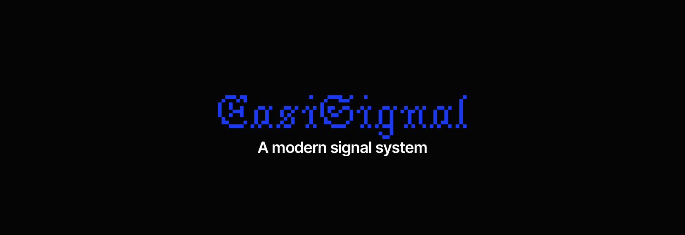

# EasiSignal

[](https://github.com/EasiSoft/easi-signal/releases/latest)
[](https://github.com/EasiSoft/easi-signal/blob/main/LICENSE.md)


C++ signal library for safe event handling.  
Designed to provide simple, type-safe connections between objects without global dependencies.

## Features
*(to be finalized after release)*

## Requirements
- C++17 or later
- Tested with MSVC 19.3+, GCC 11+, Clang 13+

## Configuration
Set via preprocessor macros:

- `SIGNAL_USE_EXCEPTIONS` (default: `0` = disabled, set to `1` to enable)  
  Toggle exception usage.
- `SIGNAL_DEBUG` (default: `0` = disabled, set to `1` to enable)  
  Enable debug logging and timing.

## Installation
Clone the repo and build with your preferred toolchain (tested with MSVC + Ninja):
```bash
git clone https://github.com/EasiSoft/easi-signal.git
cd easi-signal
cmake -B build
cmake --build build
```

## Usage
### Shared Ownership
Anyone can call` emit()` and trigger callbacks. This is useful for global signals or events where multiple parts of the system may need to fire the event.

```cpp
#include <easi/signal.hpp>
#include <iostream>

void on_event(int value) {
    std::cout << "Event received: " << value << "\n";
}

int main() {
    easi::signal::Signal<easi::signal::shared_own, int> sig;
    sig.connect(on_event);
    sig.emit(42); // allowed from anywhere
}
```
### Unique Ownership
Only the specified owning class can call `emit()`. This enforces encapsulation: external code can connect to the signal, but only the owner can trigger it.

```cpp
#include <easi/signal.hpp>
#include <iostream>

void on_event(int value) {
    std::cout << "Event received: " << value << "\n";
}

class Button {
public:
    // Signal owned uniquely by Button
    easi::signal::Signal<easi::signal::unique_own<Button>, int> clicked;

    void click() {
        // allowed: Button is the owner
        clicked.emit(99);
    }
};

int main() {
    Button btn;
    btn.clicked.connect(on_event);

    btn.click(); // triggers the callback
    // btn.clicked.emit(42); error: emit is private outside Button
}
```

## License
Licensed under the MIT License. See [LICENSE](LICENSE.md) for details.
