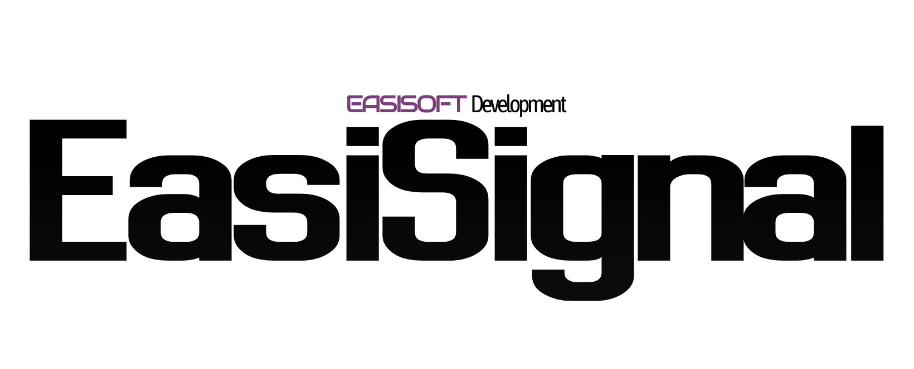

# EasiSignal

[](https://github.com/EasiSoft/easi-signal/releases/latest)
[](https://github.com/EasiSoft/easi-signal/blob/main/LICENSE.md)


C++ signal library for safe event handling.  
Designed to provide simple, type-safe connections between objects without global dependencies.

## Features
*(to be finalized after release)*

## Configuration
Set via preprocessor macros:

- `SIGNAL_USE_EXCEPTIONS` (default: `0` = disabled, set to `1` to enable)  
  Toggle exception usage.
- `SIGNAL_DEBUG` (default: `0` = disabled, set to `1` to enable)  
  Enable debug logging and timing.

## Usage

```cpp
// No arg callback
#include "signal.hpp"

struct Button {
    easi::signal::Signal<easi::signal::unique_own<Button>> onClick;
    void click() { onClick.emit(); }
};

Button btn;
auto conn = btn.onClick.connect([]() {
    std::cout << "Button clicked!" << std::endl;
});
```

```cpp
// Arg callback
#include "signal.hpp"

#include <string>

struct Button {
    easi::signal::Signal<easi::signal::unique_own<Button>, int, std::string> onClick;
    void click() { onClick.emit(404, "Failed to fetch data"); }
};

Button btn;
auto conn = btn.onClick.connect([](int code, std::string message) {
    std::cout << "Button clicked with code " << code
              << " and message: " << message << std::endl;
});
```